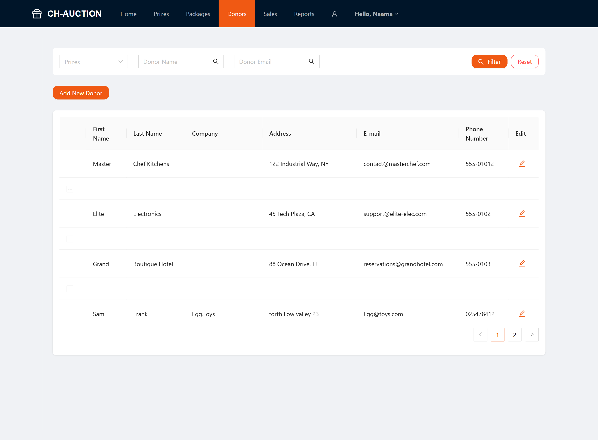

# Chinese Auction Client

This is a Chinese Auction Management System built with Angular. The application provides a seamless and interactive experience for users to browse prize packages, purchase tickets, and participate in raffles.

🚧 This project is currently under active development. 
 Expect breaking changes and incomplete features

This project is the frontend client built with Angular. It communicates with a REST API in the following link:
[Backend Repository](https://github.com/naama-git/chinese-auction-api.git))

## Key Features
### User Experience & Catalog

- [x] Dynamic Prize Catalog: Browse and filter prizes by categories and contributors with a interactive UI.

-  Advanced Shopping Cart: Manage ticket selections with a persistent cart system and a seamless checkout process.

- [x] Secure Authentication: User registration and login system for a personalized experience.

### Admin & Management

- [x] Full CRUD Management: Complete control over prizes, donors, categories, and ticket packages.

- [x] Role-Based Access Control (RBAC): Granular permissions for viewing sensitive data like orders and contributor lists.

- Automated Raffle Engine: Tools for conducting draws and generating instant winner announcements.

- Financial Analytics: Detailed reporting on raffle revenue, ticket sales, and prize distribution.


## Project Showcase
*Visual interface and user experience of the Chinese Auction platform.*

<details>
  <summary><b>Click to expand the full image gallery</b></summary>
  <br>

  ## User Interface (Client Side)
  *The experience for customers browsing prizes and purchasing tickets.*

  ### Landing and Authentication
  | Home Page | Sign In | Sign Up |
  | :---: | :---: | :---: |
  |  |  |  |

  ### Prize Gallery and Selection
  *Full width views for browsing available prizes.*
  
  **Full Gallery View:**
  

  <br>

  **Additional Gallery Views:**
  <div style="display: flex; overflow-x: auto; gap: 10px; padding-bottom: 10px;">
    
    
  </div>

  ### Checkout Flow
  *A structured journey from package selection to payment.*

  | Step 1: Package | Step 2: Information | Step 3: Confirmation | Shopping Cart |
  | :---: | :---: | :---: | :---: |
  |  |  |  |  |

  ---

  ## Admin Dashboard (Management Side)
  *Tools for system administration, donor management, and tracking.*

  ### Donor and Order Management
  **Full Donor Management View:**
  

  <br>

  | Add Donor | Orders Overview | Reports |
  | :---: | :---: | :---: |
  |  |  |  |

  ### Inventory and System Tools
  <div style="display: flex; overflow-x: auto; gap: 10px; padding-bottom: 10px;">
    
    
    
    
    
    
  </div>

  ---

  ## UI Components and States
  *Error handling and system animations.*

  <div style="display: flex; overflow-x: auto; gap: 10px;">
    
    
    
  </div>

</details>
## Getting Started
Follow these instructions to get a copy of the project up and running on your local machine for development and testing purposes.

### Prerequisites
Ensure you have the following installed:
- Node.js (Recommended: v18.13.0+ or v20.x)
- npm (comes with Node.js)
- Angular CLI: Install it globally using:
  
  ```
  $ npm install -g @angular/cli
  ```

### Installation
1. Clone the repository:
   ```
   $ git clone https://github.com/Lea2166/ChineseAuctionClient.git
   ```
   
2. Navigate to the project directory:
   ```
   $ cd ChineseAuctionClient
   ```

3. Install dependencies:
   ```
   $ npm install
   ```
### Running the application:
1. Start the developer server
   ```
   $ ng serve
   ```
2. Open your browser: Navigate to https://localhost:4200/. The application will automatically reload if you change any of the source files.
   


